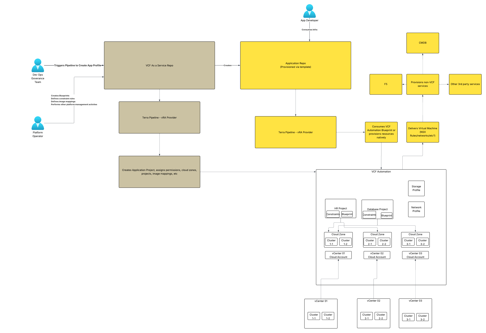

# vm-apps-private-cloud

---


---

This repository is the **control-plane automation layer** for building a fully code‑driven VMware Cloud Foundation (VCF) environment.  
It provides the GitOps workflow for creating **VCF Automation (Aria Automation 8.18) VM‑Apps projects**, onboarding application teams, and preparing their deployment repositories.

Over time, this repository will evolve into the foundation of a **VCF-as-a-Service platform**, enabling VCF to be consumed like a public cloud.

---

# 🚀 Purpose

This repository manages **platform‑level resources**, not application workloads.

It currently automates:

- Creation of **VCF Automation Projects (VM‑Apps tenants)**
- [Creation of **GitHub application repositories** mapped to each project](https://github.com/sentania-labs/vcf-lab-application-template)
- Injection of secrets, variables, and Terraform layouts into those repos
- Enabling each application team to independently deploy their infrastructure

Future expansion includes:

- NSX‑T segment provisioning  
- AVI load balancer automation  
- vDefend Distributed Firewall policies  
- Infrastructure tagging and metadata  
- Multi‑domain and multi‑region tenancy  
- Full lifecycle governance & compliance checks  

A separate repository will provide a matching architecture for **All‑Apps** tenants.

---

# 📁 Repository Structure

```
├── envs/
│   ├── example.tfvars                     # (future) Annotated example 
│   └── lab.tfvars                        # Example environment
│
└── .github/
    └── workflows/
        ├── configure-private-cloud.yml  # Automation for platform changes
        └── validate.yml                 # (future) Governance checks
├── backend.tf                           # S3 backend storing platform state
├── blueprints.tf                        # Creates blueprints declared in tfvars for each project
├── cloudAccounts.tf                     # Creates defined cloud accounts
├── cloudzone.tf                         # Creates cloud zones based on enabled regions in provisioned cloud accounts
├── flavors.tf                           # Creates flavor profiles in all cloud zones
├── images.tf                            # Creates image profiles in all cloud zones
├── LICENSE                              # MIT LICENSE
├── main.tf                              # Generates global locals and data references
├── projects.tf                          # Provisions VCFA VM Apps projects
├── provider.tf                          # VCFA + GitHub providers
├── README.md                            # This file
├── repositories.tf                      # Creates repositories based on project inputs
├── variables.tf                         # Input declarations
├── versions.tf                          # required providers and versions
```

---

# 🧭 How the System Works

## 1️⃣ Platform Team Manages This Repo

Platform engineers define **all application teams** and their environments:

```hcl
projects = {
  finance = {
    name           = "Finance"
    description    = "Finance app team"
    administrators = ["finmgr@corp", "englead@corp"]
  }
  platform = {
    name = "Platform"
    administrators = ["platops@corp"]
  }
}
```

Running Terraform:

- Creates VCFA Plumbing to vCF
- Creates VCFA Projects  
- [Creates associated GitHub repos](https://github.com/sentania-labs/vcf-lab-application-template)
- Drops in starter IaC  
- Wires repos with CI/CD  
- Configures secrets required to deploy from VCFA  

Each project receives:

- An isolated IaC repo
- Its own TF state  
- Its own VCFA project  

---

## 2️⃣ Application Teams Deploy From Their Created Repo

A project‑specific repo is generated automatically.

Inside that repo, teams receive:

- A Terraform project for Blueprint or Machine deployments  
- A GitHub Actions pipeline (`deployment.yml`)  
- A `decommission.yml` workflow to safely destroy infra  
- Backend wiring using a normalized project key  
- A clean separation from the control-plane repo  

They deploy infrastructure by simply editing tfvars and pushing commits.

---

## 3️⃣ Decommission Workflow for Safe Cleanup

VCFA Projects **cannot be deleted** if workloads still exist.

Each generated repo therefore includes a **Decommission workflow** that:

1. Runs `terraform destroy`  
2. Removes all infrastructure  
3. Cleans its Terraform state  
4. Marks the project as “safe for deletion”  

Only after this workflow completes should the platform team remove the project from `var.projects`.

This prevents:

- Orphaned workloads  
- Blocked VCFA project deletion  
- Terraform state drift  

---

# 🔧 Usage

## Step 1 — Define Environment Inputs

Create a tfvars file:

```
cp envs/example.tfvars envs/lab.tfvars
```

Example:

```hcl
vcfa_url           = "https://vcfa.lab.local"
vcfa_organization  = "lab-org"
vcfa_refresh_token = "REDACTED"

projects = {
  sandbox = {
    name           = "Sandbox"
    description    = "General experimentation"
    administrators = ["platformadmin@company.com"]
  }

  payments = {
    name        = "Payments"
    description = "Payments platform"
    administrators = [
      "payments-lead@company.com",
      "payments-eng@company.com"
    ]
  }
}
vsphere_accounts = {
  vcf-lab-wld02 = {
    name                = "vcf-lab-wld02"
    hostname            = "vcf-lab-vcenter-wld02.company.com"
    description         = "vcf-lab-wld02-DC"
    enabled_datacenters = ["vcf-lab-wld02-dc01", "vcf-lab-wld02-dc02"]
    nsx_manager         = "vcf-lab-nsxmgr-wld02"
    capability_tags = [
      {
        key   = "cloud",
        value = "vsphere"
      },
      {
        key   = "availabilityZone",
        value = "az1"
      }
    ]
    image_mappings = [
      {
        image_name    = "ubuntu22",
        template_name = "vcf-lab-wld02 / ubuntu22", //when referencing a content library you must preceed the template name with it
        cloud_config  = ""
      },
      {
        image_name    = "ubuntu24",
        template_name = "vcf-lab-wld02 / ubuntu24", //when referencing a content library you must preceed the template name with it
        cloud_config  = ""
      }
    ]
  }
}

```

---

## Step 2 — Run Terraform

```bash
terraform init -backend-config="key=vcf/control-plane.tfstate"
terraform plan  -var-file="envs/lab.tfvars"
terraform apply -var-file="envs/lab.tfvars"
```

This will:

✔ Create VCFA Projects  
✔ Create GitHub repos per project  
✔ Push secrets + variables to those repos  
✔ Apply naming conventions + governance  

---

## Step 3 — App Teams Take Over

Each project repo includes:

- IaC folder
- CI/CD pipeline
- Decommission workflow
- Backend definition

App teams deploy VMs or blueprints using:

```bash
terraform apply -var-file="envs/app.tfvars"
```

---

# 🔐 GitHub Actions Workflows

### `configure-private-cloud.yml`
Used by this repo to apply platform changes:

- Validates all project definitions  
- Applies changes to VCFA Projects  
- Creates updates/deletions in GitHub  

### `decommission.yml` (in generated repos)
Ensures infrastructure is torn down **before** project deletion.

### `validate.yml` (Future)
Governance checks such as:

- Correct repo structure  
- Required secrets  
- Branch protections  
- Policy compliance  
- Required labels/tags in VCFA  

---

# 🛡 Safety Model

This repo follows a **two-phase lifecycle deletion**:

| Phase | Action | Required? |
|------|--------|-----------|
| 1 | App repo runs `decommission.yml` | ✅ Prevents orphaned workloads |
| 2 | Platform repo removes project + repo | ✅ Final removal |

This prevents:

- Bricked VCFA project deletions  
- Lost Terraform state  
- GitHub repo deletion with active workloads  

---

# 🌐 Vision: VCF-as-a-Service

This repository forms the backbone of a GitOps-driven VCF platform:

- App teams get cloud-like tenancy  
- Platform team enforces guardrails + governance  
- Infrastructure becomes fully declarative  
- Operations scale with automation  

A parallel repo will extend this to **All‑Apps** tenants for full platform coverage.

---

## Questions?

Feel free to reach out to me at [scott.bowe@broadcom.com](mailto:scott.bowe@broadcom.com) or [scottb@sentania.net](scottb@sentania.net).  Alternatively, feel free to open an issue.

---

# 📄 License

MIT License
